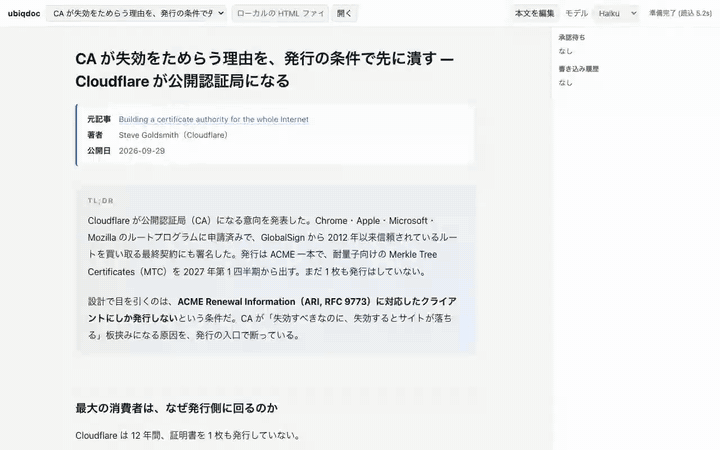
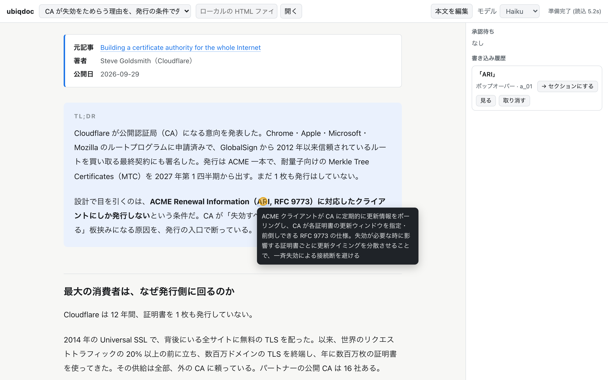
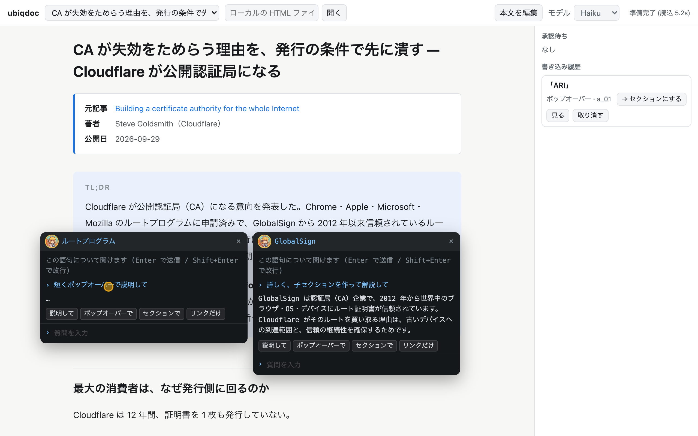
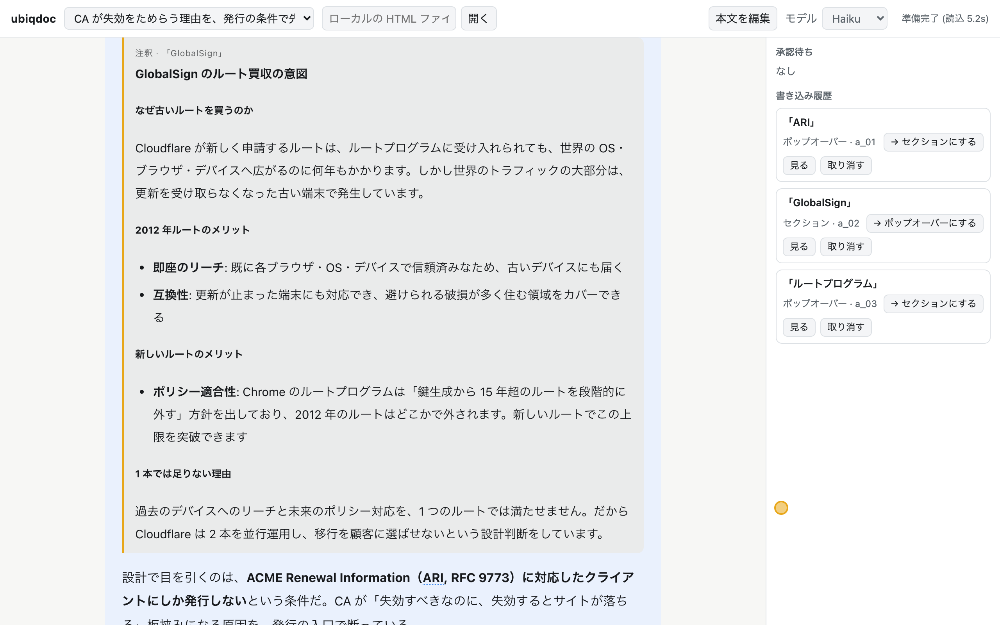
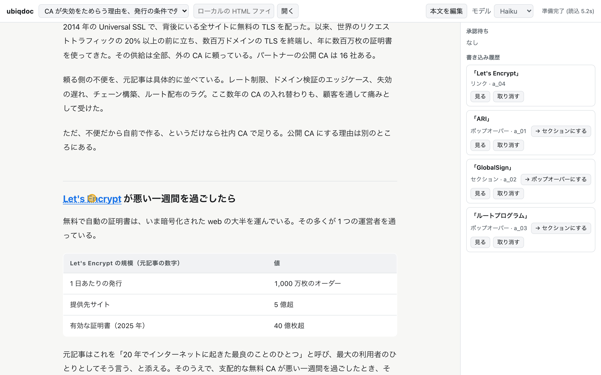

# ubiqdoc

ドキュメントを読んでいて、どの瞬間でもすぐ AI とチャットできるリーダー。

ローカルの HTML 文書をブラウザで開き、分からない語句をドラッグすると、その場に小さなチャット窓が開く。
答えはポップオーバー・子セクション・リンクのどれかの形で、**文書の本文に直接書き込まれる**。
前の答えを待たずに、次の語句をいくつでも並行して聞ける。

A local document reader where you can drag any phrase and ask an AI about it on the spot. Answers are written back into the document itself as popovers, child sections, or links, and you can ask about several phrases in parallel.



フル尺の動画 (70 秒、等速): [docs/demo.mp4](docs/demo.mp4)

## なぜ作ったか

ターミナルに移って質問を打ち、前の返答を待っているうちに、さっきまで何を読んでいたのかを忘れる。それを無くしたかった。

- 窓は選んだ語句のその場に開く。目線を別の窓に移さない
- 前の答えを待たない。答えを待っている間も、次の語句に聞ける
- 答えは読んでいた場所に入る。会話ログの中から探し直さなくていい

設計の経緯と試行錯誤は記事に書いた: [ドキュメントを読んでいて、どの瞬間でもすぐ AI とチャットできるリーダーを作った (Zenn)](https://zenn.dev/ruri/articles/ubiqdoc-ai-chat-reader)

## できること

| | |
|---|---|
|  | **ポップオーバー**: 短い説明。語句にホバーすると出る |
|  | **並列**: 答えを待っている間に、別の語句でも窓を開ける。新しい窓は待っている窓を避けて開く |
|  | **子セクション**: 長い説明。語句を含む段落の直後に、注釈とわかる枠付きで入る |
|  | **リンク**: 一次情報を示すだけで足りるとき |

- 書き込み方は窓のボタン (「ポップオーバーで」「セクションで」「リンクだけ」) で指定する。指定しなければ AI が選ぶ
- 右のペインで、質問 1 回分の取り消し、ポップオーバーとセクションの相互変換、AI からの本文書き換え提案の承認ができる
- 「本文を編集」で本文を直接直せる (自動保存)。編集を終えると、直した本文を AI が読み直す
- 書き込むのは元のファイルではなくコピー (`data/<docId>/doc.html`)。書き込み済みのコピーは単体で開いても注釈込みで読める

## 必要なもの

- Node.js 18 以上 (依存パッケージは無い)
- [Claude Code](https://docs.claude.com/en/docs/claude-code) の CLI (`claude`) にログイン済みであること。質問のたびに `claude -p` を起動する
- macOS + Chrome で動作確認している

## 使い方

```bash
git clone https://github.com/atsushiootani/ubiqdoc.git
cd ubiqdoc
node server.js                     # http://127.0.0.1:8910/
UBIQDOC_PORT=9000 node server.js   # ポートを変えるとき
```

| 環境変数 | 既定 | 何を変えるか |
|---|---|---|
| `UBIQDOC_PORT` | `8910` | 待ち受けポート。`PORT` より優先する |
| `PORT` | — | 後方互換。ほかのツールと一緒に起動すると**この値が漏れてくる**ので、そのときは `UBIQDOC_PORT` を使う |
| `UBIQDOC_DATA_DIR` | `./data` | 開いた文書と会話ログの置き場 |

1. 上のバーに HTML ファイルの絶対パスを入れて「開く」。裏で AI が文書を読み込み、右上が「準備完了」になる
2. 語句をドラッグして、窓で質問する (Enter で送信 / Shift+Enter で改行)
3. 文書の背景をクリックすると窓が閉じる。閉じても、返答待ちだった答えは文書に書き込まれる

モデルは右上で Haiku / Sonnet / Opus から選べる (既定は Haiku)。

### 元のファイルに直接書き込む

既定では、書き込み先は元のファイルではなくコピー (`data/<docId>/doc.html`) になる。
**「元ファイルに書く」にチェックを入れると、開いたファイルそのものに注釈が入る。**
読んでいる文書を育てたいとき（自分のメモ・設計書・調査ノート）はこちら。

- 取り消しは今までどおり効く。質問 1 回ぶんの直前の状態は `data/<docId>/history/` に残る
- **git などで戻せるファイルで使うことを勧める。** 控えは history だけなので、そこを消すと戻せない

### 外のツールから開く

`?open=<絶対パス>` を付けて開くと、そのファイルをそのまま開く。
エディタ・ファイラ・自作のダッシュボードから、リンク 1 本で送れる。

```
http://127.0.0.1:8910/?open=/Users/me/notes/design.html          # 元ファイルに書く
http://127.0.0.1:8910/?open=/Users/me/notes/design.html&inPlace=0 # コピーに書く
```

同じファイルを開き直したときは、前の文書をそのまま開いて「既に開いています」と知らせる
（新しく作り直したいときは `/api/open` に `fresh: true` を渡す）。
開いたあとに元ファイルが外で書き換わったら、上に帯が出る。
**読み直しは自動では走らない** —— 帯の「読み直させる」を押したときだけ `claude` を焚く。

## しくみ

- 文書を開いた時点で、全文を読ませただけの**ベースセッション**を 1 本作る。窓で最初に質問したときは `claude -p --resume <base> --fork-session` で複製して答えさせる。同じ窓の 2 回目以降はその枝を続ける。毎回文書を読み直さないので速く、枝同士は互いの会話を知らないので並列にしても混ざらない
- 実測 (Haiku、約 17KB の記事): fork 単体 4.5〜6.3 秒 (3 本並列でも同じ)、ポップオーバー 6.6〜8.2 秒、子セクション 11〜15 秒
- 書き込みはブラウザ側で 1 件ずつ反映する。JavaScript は単一スレッドなので、届いた順 = 先着優先になる
- claude のセッションは `~/.cache/ubiqdoc` を作業ディレクトリにして作る (resume に同じ cwd が要るため)

## 注意

- **手元の Mac でだけ使う想定**。サーバは `127.0.0.1` にだけ bind し、Host が `127.0.0.1:<PORT>` / `localhost:<PORT>` 以外のリクエストと、他サイトからの書き込み要求を断る。リクエストを受けて `claude` を起動するサーバなので、外部に公開しないこと
- 入力は HTML だけ。文書の中の script は動かさない (mermaid などの図はコードのまま見える)
- 子セクションの答えは 10 秒を超えることがある
- AI が、選んだ語句より広い範囲に注釈を付けることがある。既にある注釈と重なった書き込みは「承認待ち」に回る
- 個人用ツールとして作ったもので、サポートは約束できない

## ライセンス

- コード: [MIT](LICENSE)
- マスコット画像 (`public/avatar-smile.jpg` `public/avatar-thinking.jpg`): CC0。自由に使ってよい
